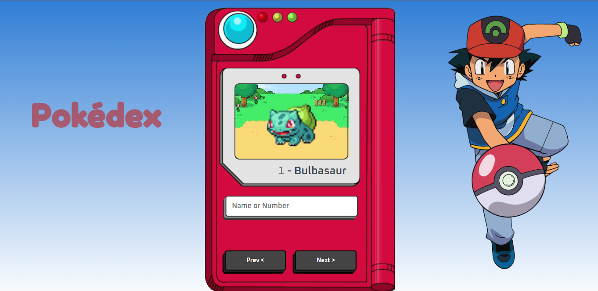

<h1>POKÉDEX</h1>

 
<i>Pokédex create with JavaScript, CSS and HTML.</i>

 

 
 <ul>
  <li>press next to advance to another pokemon</li>
  <li>or click the box and enter the number or name</li>
 </ul>
 
 
 
